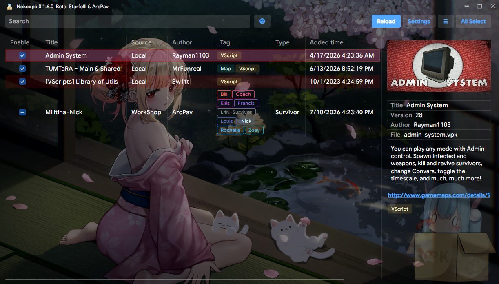
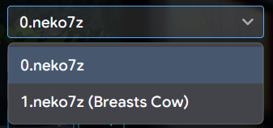

<h1 align="center">
   
  
   
  NekoVpk
   
</h1>
<h4 align="center">🧰 Left4Dead2 addon manager </h4>
<h1 align="center">
  
</h1>

## 🐈feature
* Intelligently identify tags based on addon content
* Keyword search
* Read addoninfo
* Enable or disable addon
* Disable certain content in the addon, which is useful for survivor mods.
* 
* 

## Special Dependencies
https://github.com/Starfelll/ValvePak/tree/nekovpk
https://github.com/Starfelll/ValveKeyValue/tree/nekovpk

## changelog
#### v0.1.6
- **Localization**: Added multi-language support (English, Chinese, Japanese).
- **Conflict Detection**: Added addon conflict detection. Conflicting mods are highlighted in red; double-clicking displays specific conflicting files and priority.
- **Collection Mode**: Added Workshop Collection mode. Toggle to search for collections, single-click to view summaries, and double-click to browse the addons inside.
- **[Archive Management](docs/How-To-Create-Neko7z.md)**: Added support for handling multiple `.neko7z` packages (e.g., `1.neko7z`, `2.neko7z`) when selectively enabling/disabling addon contents, removing the previous limit of a single `0.neko7z` file.
- **Workshop Filtering**: Added sorting options (Trending, Top Rated, Most Recent, Recently Updated) to the online mode.
- **Workshop Search**: Pasting a full Workshop URL into the search bar now directly triggers the download.
- **Workshop UI**: Added support for rendering GIF previews and parsing BBCode in descriptions.
- **Workshop UI**: Relocated the download button to sit above the addon description for easier access.
- **Tag Filtering**: Improved tag filtering to allow selecting main category tags (not just specific sub-tags).
- **List Settings**: Columns now auto-resize. Added options to toggle the visibility of specific columns (Tag, Type, Added time, Size).
- **UI/UX**: Optimized various UI elements and confirmation dialogs.
#### v0.1.5
- Fixed the issue that files would be lost when only one disabled vpk content was left.
- Setting: added option "Compression level".
#### v0.1.4
- Store window size and position.
- Tag: merge zoey_light, francis_light, bill_death_pose, modify script to vscript.
- Fixed a bug that caused the window to freeze when vpk content was enabled.
#### v0.1.3
- Skip reading failed vpk files
#### v0.1.2
- Tag: Support for infected assets.
- Add a new column to display the type of addon.
#### v0.1.1
- Automatically back up files when they are modified.
#### v0.1.0
- Breaking updates, mods that disable some content need to be fully enabled in the old version to be recognized in the new version.
- Enable file compression for disabled content.
- New UI layout.
- Add tags: zoey_light,bill_deathpose,francis_light.
#### v0.0.8
- Supports searching file names.
- During the scanning process, the workshop directory is no longer required.
- Close the file handle after reading the image.
- TaggedAssets.jsonc: added weapon-related tags.
#### v0.0.7.1
- TaggedAssets.jsonc add tags: particle,sound,spr,xdr,skybox
- Identify the vpk with a numeric file name as the workshop id
- Fixed an issue where addon titles with the same characters as tags would not be displayed in the search list
